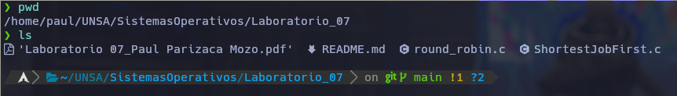

# Sistemas Operativos - Lab 07
## Por: Paul Parizaca Mozo

### Ejecucion

Una vez nos encontremos en el directorio.



Podemos compilar y ejecutar el algoritmo Round Robin

```
gcc -o RR round_robin.c
./RR
```
y podemos compilar y ejecutar el algoritmo Shortest Job First

```
gcc -o SJF ShortestJobFirst.c
./SJF
```
