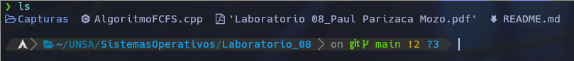

# Sistemas Operativos - Lab 08
## Por: Paul Parizaca Mozo

### Ejecución

Una vez nos encontremos en el directorio.



Podemos compilar y ejecutar el algoritmo FCFS

```
g++ -o eject AlgoritmoFCFS.cpp
./eject
```
